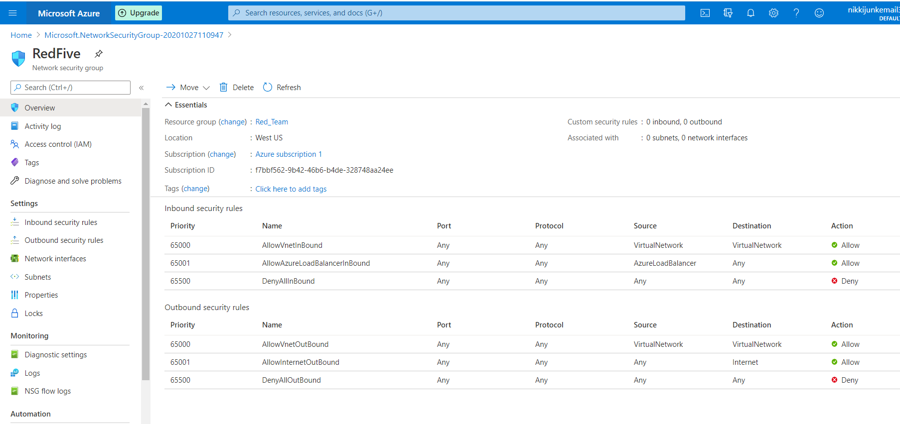
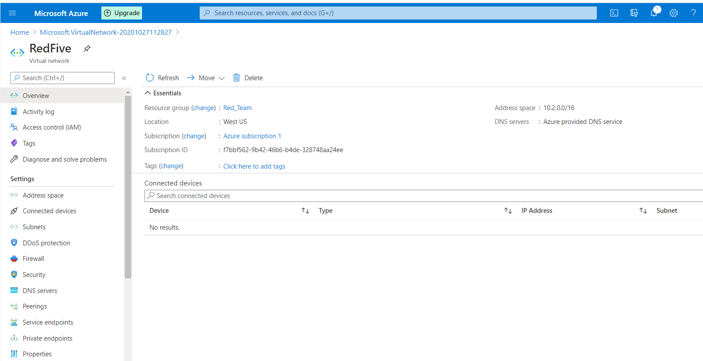

# Microsoft Azure Cloud Security Network Setup in preparation for the ELK Stack Deployment

Cloud computing server models, cloud networking, firewalls and virtual computing. Identify an appropriate service depending on an 
organization's needs.

The files in this repository were used to configure the network depicted below.

This document contains the following details:
- Setup a Virtual Private Cloud Network
  - Staying Organized: Resource Group 
  - Adding a Virtual Network
- Protect the Cloud Network with a Firewall
  - Network Security Group (NSG)
    - Inbound Security rule to SSH from Jump Box to the Network
- Deploy a Virtual Computer to the Cloud Network
  - Setting up the Jump Box Provisioner (VM)
    - Test SSH into the Jump Box Provisioner
  - Create Web VM's Web 1 and Web 2
- Docker: Configure Jump Box to run Docker Containers and install a container
  - Docker and Ansible
  - Test SSH into the Web VM's
  - Test Ansible to verify installed and running
- Configuration files to let Ansible Make Connections
  - Nano ansible.cfg file
  - Nano hosts file
  - Pinging the Webservers
- Creating the Load Balancer
  - Firewall Configuration
  - DVWA 
  
- References:
    - Public Key Setup  
      - Public Key for the Jump-Box-Provisioner
      - Public Key for the Web VM's  

These files have been tested and used to generate a live Cloud Network using VM's and containers.  


# Setup a Virtual Private Cloud Network ###

  ## Staying Organized: Resource Group ##

A resource group is a logical grouping of all resources used for a particular setup or project. The resource group will contain 
the network, firewalls, virtual computers, and other resources that are needed for setup.

Different organizations use different naming conventions for resource groups and their contents. Simply name the resource groups 
based on the project or activity they correspond to. When working in a professional setting, take note of how the employers name the 
resource groups.

###The first step to creating an environment in Azure is to create a resource group. Once we have a resource group, we can start 
adding items to it, the first of which will be a virtual network. ###

1. Open your Azure portal and search for **Resource Group**


2. Select **Resource Groups** in the search results and note the + **Add** button at the top


3. Create a name for the resource group and choose a region
	* Note: Every resource you create after this must be created in the exact same region.

4. Click on **Review + Create** button


5. Azure will alert the user if there are any errors.  Click Creat to finalize your settings and create the group


6. Once the group is created. Click on **Go to resource group** to view the new resource group
	


Defaults Inbound and Outbound Security Rules are set



*Note: User can also click on the bell icon in the upper right hand corner to view the status


Now that we have a resource group, we can add a virtual network.

  ## Adding a Virtual Network ##

A virtual network is just what it sounds like; a collection of virtual machines that can communicate with each other.  Before you can deploay 
server and services, there must be a network where these items can be accessed.

  - Unlike physical networks, which need physical wiring to achieve connections and discovery, virtual networks are much more flexible. 
    The VMs on a virtual network can live in completely different data centers, but perform as if they are wired, as well as provide improved 
    availability.


  - Virtual networks can be quickly and easily reconfigured by clicking a few buttons in the portal. This is much faster and safer than rewiring 
    a physical network to improve segmentation. It also results in less human error.


 
1. Return to the home screen and search for **Virtual Networks**


2. Click on the + **Add** button on the top-left of the page


3. Populate the required fields
   - Subscription - The free subscriptionshould be the only option here
   - Resource Group - This should be the resource group you created 
   - Name - A descriptive name so it will not get confused with other cloud networks in the same account
   - Region - Make sure to choose the same region you chose for your resource group

**Note: Carefully configuring the region of your resources is important for ensuring low latency and high availability. Resources should be 
located as close as possible to those who will be consuming them.**

4. Once the fields are populated under **Basic** either click the **IP Addresses** Tab or the **Next:IP Address** button at the bottom


5. IP Address: Azure requires the user to define a network and subnet 
   - In my example I used the defaults


6. Either click **Security** or the **Next:Security** button at the bottom
   - In my example I left the default settings


7. Either click **Tags** or the **Next:Tags** button at the bottom
   - In my example no Tags are needed


8. Click **Review + create** and then *Create*


9. Click the Go to resource to view the Virtual Network and Resource Group that was setup


- In my example I have the RedFive Virtual Network and is attached to the Red_Team Resource Group




#Protect the Cloud Network with a Firewall#

Once the Virtual Network and Resource Group is completed the rest of the cloud infrastructure can be setup.  The goal is to have
a virtual network setup and protect it with a firewall.  On the Azure platform, our basic firewall is called a **network security 
group (NSG)**. We will use a network security group to block and allow traffic to our virtual network and between machines on that 
network.

  ##Network Security Group (NSG)##

In this example

1. Go back to Home and locate **Network Security Group** by either:
   - Searching using the **Search Bar** at the top of the screen
   - Under the **Azure Services** locate just below the search bar
   - Under the **Recent Resources** you can see the newly created **Resource Group**


2. Locate the Network Security Group (NSG) and click on it.  The NSG screen will display all the default Inbound and Outbound security rules
   - To add a new Inbound security rule locate on the left hand side of the screen under Settings **Inbound security rules**


Note: The default Inbound security rules indicate the following:

      - The first rule allows all traffic to flow inside the vNet with destination and source both set to 'Internal Network'.
        - This means that all machines deployed using this Security Group will be able to communicate with each other.

      - The second rule allows all traffic coming from a load balancer.
        -This means that if there were a load balancer assigned to this security group, it could send traffic to all the resources on the 
         internal network.

      - The final rule blocks all other traffic.
        - This means that all traffic from the internet is automatically blocked to any resource you protect with this Security Group.

When a machine is deployed to your virtual network using this security group, you will have to create a rule that allows access to the resource.


3. In the Network Security Group | Inbound security rules click the **+ Add** button


4. On the right hand portion of the screen is where the user will define the new Inbound security rule
   - Source - Choose **Any** source to block all traffic.  In this example **IP addresses** was selected
     - Since IP Addresses was selected enter the Soure IP Addresses.  This IP would be of the host network.
   - Source Port Ranges - Are always random, even with common services like HTTP. Therefore, keep the wildcard (*) to match all 
     source ports.
   - Destination Port Ranges - Usually, you would specify a specific port or a range of ports for the destination. In this case, you can use 
     the wildcard (*) to block all destination ports. You can also block all ports using a range like 0-65535. In this example 22 was entered.
   - Protocol - Block Any protocol that is used.  In this example TCP was selected.
   - Action -  Use the Block action to stop all of the traffic that matches this rule.  
   - Priority - This rule will always be the last rule, so it should have the highest possible number for the priority. Other rules will always 
     come before this rule. The highest number Azure allows is 4,096.  In this example 4001 was entered.
   - Name - Give your rule a name like "SSH_Allow_Inbound."
   - Description - Write a quick description similar to "This will allow us to SSH from our local machine."

5. Click **Add** to save this rule


6. Once this rule is added this will display under the Inbound security rules


   ## Inbound Security Rule to SSH from the JumpBox to the Network##

In addition setup an Inbound Secuirty rule to SSH from the JumpBox to the network needs to be added.  Refer to the steps NSG step above.


#Deploy a Virtual Computer to the Cloud Network#

Virtual computing is very common in today's internet infrastructure. In fact, many of the servers that you interact with on a daily basis are 
actually virtual servers.

Virtual computers have all the same components that physical computers have, but, as expected, they are defined by software.

When you set up a virtual machine, you'll often need to decide how powerful you need the machine to be and choose each of the main hardware 
components.

   ##Setting up the Jump Box Provisioner (VM)##


1. Navigate to the Azure Home Page and search for *Virtual Machines*


2. Click the **+ Add** button to create the new Virtual Machine (VM)


- The tabs across the top of the VM create page have fields to enter based on the needs.  In this example the focus is on **Basics**, **Disks**, 
     **Networking** and **Review + Create** tabs.


3. Under the **Basics** Tab populate the required fields
   - Resource Group - In this example the VM was added to the Red_Team NSG
   - Virtual Machine name - In this example the VM was named Jump-Box-Provisioner
   - Region - Must be in the same region as the resource and security groups
   - Availability options
   - Image - Left with the default
   - Size - In this example size is set to Standard_B1s
   - Authentication type - Using SSH Public key in this example
   - Username - In this example used RedFive as the username
   - SSH public key source - Used an existing public key
     - **Note: Refer to the Public Key setup under the References if needed**
   - Inbound port rules - left as the default **Allow selected ports** for SSH (22)


4. Under the **Disks** tab leave the fields with the defaults


5. Under the **Networking** Tab
   - Make sure these new VMs are assigned to your security group.
   - Jump Box Provisioner is set with a Public IP (using the default - no changes made) 


6. Click the **Review + Create** Button

7. Click the **Create** Button


  ##Test SSH into the Jump Box Provisioner##

1. Launch Gitbash or command line

2. SSH using the username and the Jump Box Provisioner IP address

3. If successfully connecting the command line will now show as Jump-Box-Provisioner


   ##Create Web VM's Web 1 and Web 2##


- Create 2 more new VMs with the following properties:
  - Refer to the Jump Box Provisioner for the steps.  The Web VM's will have a few slight differences see below:

1. Each VM should be named "Web-1" and "Web-2"

2. Each VM must be created in the Red_Team resource group.

3. Each VM must be located in the same region as your resource and security groups.
   - Note - that availability of VMs in Azure could cause you to change the region where your VMs are created.

4. Choose an administrative username that you can remember easily. In this example RedFive is the username
   - You should use the same username name for the Web VM's
   - Make sure to take a note of this username, as you will need it to login later.

5. You will need to create a new SSH key for remote connections. Note that you are using an SSH key instead of setting a password.
   - Note: Windows users should use GitBash to create ssh keys and ssh connections.
   - Use ssh-keygen to generate SSH keys and ssh to open SSH connections.
   - Refer to the References section on the public key for the VM's

6. Choose the VM option that has:
   - Whose offering is Standard - B1ms
     1. CPU
     2. RAM

   - Note:: These web machines should have 2 GB of RAM and the Jump-Box only needs 1 GB. All machines should only have 1 vCPU because 
     the free Azure account only allows 4 vCPU's in total per region.

7. It is crucial to make sure both of these VM's are in the same availability Set. Follow the steps below:
   - Under Availability Options, select 'Availability Set'.
   - Click on 'Create New' under the Availability set.
   - Give it an appropriate name, e.g.: "Red_team". Make sure both VMs are in the availability set.
   - Save your changes


8.  Networking Tab
    - Change Public IP to None
    - NIC network security group select Advanced
    - Configure network security group 

9. Click **Review + create** and then **Create**


#Docker: Configure Jump Box to run Docker Containers and install a container#

1. Start by installing `docker.io` on your Jump box.
   - Run `sudo apt update` then `sudo apt install docker.io`


2. Verify that the Docker service is running.
   - Run `sudo systemctl status docker`

Note: If the Docker service is not running, start it with `sudo systemctl start docker`


3. Once Docker is installed, pull the container cyberxsecurity/ansible.
   - Run sudo docker pull cyberxsecurity/ansible.


**Note: You can also switch to the root user so you don't have to keep typing sudo.
  - Run `sudo su`

4. Launch the Ansible container and connect to it using the appropriate Docker commands.
   - Run `docker run -ti cyberxsecurity/ansible:latest bash` to start the container.
   - Run `exit` to quit.


   ##Docker and Ansible##

- We will be using the Ansible container on our jump box to connect to another VM and make configuration changes.

- We need to create an SSH key pair on the Ansible container and reset the SSH keys on our Web-VM's to use the SSH id_rsa.pub file 
  from our Ansible container.

- Once you are connected, there are a few Docker commands we will need in order to get the container up and running.

  - If we began the with the same command we used to create our container, we would end up creating another new container.

  - We want to make sure we are only running one container and that it is the same container every time we use Ansible.

**IMPORTANT NOTE The difference between **docker run** and **docker start** is very important! **docker run** will create a new container from 
the container image and that new container will have default settings. None of your previous Ansible changes will be there. Because of 
this, docker run should only be used on the first time the Ansible container is created/started. **docker start** should be used every time 
thereafter, or problems with the activities will arise because of missing files on the Ansible container.  Begin by connecting to your 
jump box via SSH**

5.  List all the containers created on the system:
    - Run `docker container list -a`
    - Your output should resemble the following


   
    - In this example, the container name is youthful_gates, but your container will have a different name.
    - This name will be automatically created. These names are generated by randomly pairing a strong adjective 
      with the last name of a notable computer programmer.
    - Your unique container name will be used when referring to a container with Docker commands.


6. Type `sudo docker start youthful_gates`
   - sudo docker: Uses sudo to run Docker with root.
   - start: Initiates the container that follows.
     - container_name: The unique name for your container.


7. Run the command and note that nothing seems to have happened.
   - $ sudo docker start container_name
   - $ hardcore_brown

8. List all running containers:
   - Run `sudo docker ps`
   - You should see your container in the list


9. Activate a shell on your container:
   - `Run sudo docker attach container_name`

10. Your prompt has changed to `root@23b86e1d62ad:~#` and you are now connected to your **Ansible Docker container**.


  ##Test SSH into the Web VM's##

- Ensure the that ssh-key gen is updated on each of the Web VM's
  - Refer to the Public key Setup to verify the setup


- Run `ssh username@Web1 IP address and do the same step but for the additional Web VM's


- Type exit to get out of the Web VM and close the SSH connection and this will take you back to the Ansible Docker container** as `root`


  ##Test Ansible to verify installed and running##

- Run `ansible`.  Ansible should now be installed and running


#Configuration files to let Ansible Make Connections#

We must make two changes to the configuration files to let Ansible make connections:

   - Ansible needs to know which administrative username it should use when making SSH connections. This will be the admin username you used when you 
     created your Web-VM's.

   - Ansible needs to know the IP address of the VM you want it to connect to.

Each of these settings is located in a different file, but all Ansible configurations live in /etc/ansible.

Run `cd /etc/ansible` and then ls to show all the files:
root@9bd16493749f:~# cd /etc/ansible/
root@9bd16493749f:/etc/ansible# ls
ansible.cfg  hosts  roles
root@9bd16493749f:/etc/ansible#


  - ansible.cfg: The file with the setting for the admin name that should be used.

  - hosts: The file with all of the IP addresses that should be used.
  
   ##Nano ansible.cfg file##

- Use Nano to open the ansible.cfg file:


This setting  is called the remote_user. We will need to make sure that this user matches the admin username we use when we create the new VM.

Scroll down or search for the remote_user option.

We need to uncomment the remote_user line and replace root with the admin username you used when creating the Web-VM's.

The file should look like this:


- Exit the file

   ##Nano hosts file##
   
Run `nano hosts` to open the hosts file with Nano.

  - This file must contain the IP address for any machines that Ansible connects to.

  - Machines can be grouped together under headers using brackets:

    - [webservers] or [databases] or [workstations]headers can all hold different groups of IP addresses, which Ansible can run configurations 
	  on individually or together.

- Add our IP to the provided web server header.

- Uncomment the [webservers] header line.

- Add the Web VM's IP addresses under the [webservers] header as an example.
  - The way Ansible works is, it creates a python script and then runs that script on the target machine using that machine's installation of Python. Typically, 
    Ansible may have issues determining which python to use on the target machine, but we will solve this by forcing ansible to use python 3 on each machine we 
	configure.  Add the line: `ansible_python_interpreter=/usr/bin/python3` besides each IP address.
	- Without this line, Ansible will still connect, but you will see this Warning:

```bash
[DEPRECATION WARNING]: Distribution Ubuntu 18.04 on host 10.0.0.5 should use
/usr/bin/python3, but is using /usr/bin/python for backward compatibility with
prior Ansible releases. A future Ansible release will default to using the
discovered platform python for this host. See https://docs.ansible.com/ansible/
2.9/reference_appendices/interpreter_discovery.html for more information. This
feature will be removed in version 2.12. Deprecation warnings can be disabled
by setting deprecation_warnings=False in ansible.cfg


- Run `nano hosts`


- The file should resemble the following:


- Exit the file

   ##Pinging the Webservers##

- Ansible has a ping command that will verify these connections.


1. Run ansible -m ping webservers
   - We are specifying the [webservers] group that we just created.
   - We could target any group in the hosts file or we can target all the machines in any group by using ansible -m ping all.

- ansible: Used to run one-off Ansible commands.

  - -m: Specifies the Ansible module to run.

  - ping: Module that checks the connection with each of the machines given.

  - all or webservers: The group of machines you want to run the ping module on.
    - all will run it on all the hosts listed in the hosts file.  In this case, there is only one host, so either group will work.

- Output of a successful ping command should resemble:


#Creating the Load Balancer#

- At this point, we have created a virtual network, deployed a jump box running an Ansible Docker container, and used that container to configure another VM running a DVWA container.

- If the Red Team attacks this DVWA container with enough traffic, they may be able to trigger a Denial of Service (DoS) on the machine.
  - DoS attacks are a common problem with websites.

- One way to mitigate DoS attacks is to have multiple servers running the same website, with a load balancer in front of them.

- A load balancer provides a website an external IP address that is accessed by the internet.

- The load balancer receives any traffic that comes into the website and distributes it across multiple servers.

- As the website receives more traffic, more servers can be added to the group ("pool") of servers that the load balancer has access to. This helps distribute traffic evenly among 
  the servers and mitigates DoS attacks.  The Load balancer has to be created first before setting up the back end pools.

- A load balancer typically also has a health probe function. This function checks regularly to make sure all of the machines behind the load balancer are functioning before sending 
  traffic to them. Machines with issues are reported, and the load balancers stop sending traffic to those machines.  This system can still be overwhelmed with traffic and taken down, 
  but it is much more resilient than if a single server was running the website.  The DVWA VM you set up is intentionally not accessible from the internet at this time. The next step
  is to set up a load balancer with an external IP and point it to the VM.  The Load balancer has to be created first before setting up the health probe.
  
  
1. Open your Azure portal and search for "load balancer."

2. We can add the load balancer with the same + Add button that exists on other pages in the Azure portal.

3. Select the relevant Resource Group.

4. Provide a Name

5. Select the same resource group as your other resources.

6. Select 'Create New' for the Public IP address setting.

7. Give the public IP a name

Note that this name is used to create a URL that maps to the IP address of the load balancer. Because of that, it must be a unique name across all of Azure.
Look for the green check mark to determine if the name will work.

8. For the IP Assignment, choose 'Static'

9. Click on Review + create and confirm


10. Add a health probe to regularly check all the VMs and make sure they are able to receive traffic.


11. Create a backend pool and add your VM to it.


  ##Firewall Configuration##

Configure the load balancer and security group to work together to expose port 80 of the VM to the Internet.


1.  Create a load balancing rule to forward port 80 from the load balancer to your Red Team VNet.
    - In the Load Balancer click on Load Balancing rule on the left hand side of the screen then click **+ Add**
    - Name: Give the rule an appropriate name that you will recognize later.
	


2.  IP Version: This should stay on IPv4.
    - Frontend IP address: There should only be one option here.
    - Protocol: Protocol is TCP for standard website traffic.

3. Port: Port is 80.
   - Backend port: Backend port is also 80.

4. Backend pool and Health probe: Select your backend pool and your health probe.

5. Session persistence: This should be changed to Client IP and protocol.
   - Remember, these servers will be used by the Red Team to practice attacking machines. If the session changes to another server in the middle of their attack, it could stop them from successfully completing their training.

6. Idle timeout: This can remain the default (4 minutes).

7. Floating IP: This can remain the default (Disabled)

  
  
  ##DVWA#
  
- Remove the security group rule that blocks all traffic on your vnet to allow traffic from your load balancer through.

- Remember that when we created this rule we were blocking traffic from the allow rules that were already in place. One of those rules allows traffic from load balancers.

- Removing your default deny all rule will allow traffic through.

- Verify that you can reach the DVWA app from your browser over the internet.

- Open a web browser and enter the front-end IP address for your load balancer with /setup.php added to the IP address.
  - For example: http://40.122.71.120/setup.php
  - Note: With the stated configuration, you will not be able to access these machines from another location unless the security Group rule is changed


  
  
  
  

#References#

  ##Public Key Setup## 

  **Public key on the Jump-Box-Provisioner**
  
- You will need to create a new SSH key for remote connections. Note that you are using an SSH key instead of setting a password.

**Note: Windows users should use GitBash to create ssh keys and ssh connections.**

- Use `ssh-keygen` to generate SSH keys and ssh to open SSH connections.

  
- If the Public key was created use `cat .ssh/id_rsa.pub` to view 


 
  **Public key on the Web VM's**

- During the activity you will need to create an SSH key from inside the ansible container and use that SSH key to create a new VM. 
  - Run `ssh-keygen` to create an ssh key inside the ansible container.  Hit enter 3 times to accept all default key settings 
  (located in /root/.ssh/id_rsa.pub and no password)
  - Run `cat .ssh/id_rsa.pub` to view the existing public key
  

  
- Reset the password for one of your Web-VM's inside the azure portal on each of the Web VM's and copy over your new ssh key
  - Click on each Web VM and on the left hand side scroll down and look for reset password and update the username and SSH Public Key


